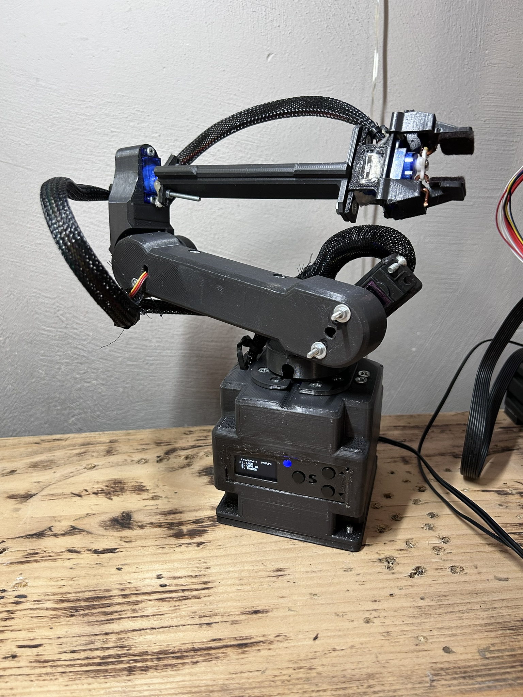
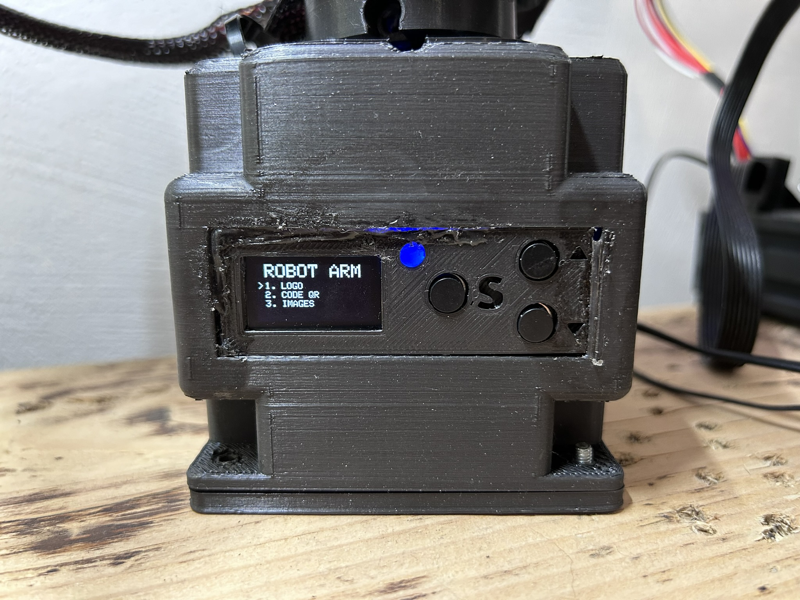

# Robotic_arm_CyberLimb
## General info
 I was creating my own robotic arm. I was building this for 2.5 months. I used a lot of technologies like print 3d or app fusion 360, below are alls.
 - Weight: 520g 
 - Dimensions: 32.5cm x 32.5cm x 9.3cm
	
## Technologies
Project is created with:
* C/C++
* print 3d (creality ender 3 pro)
* fusion 360 (model)
 
## Setup
To run this project, install arduino ide to upload code to arduino nano.

## The most important photos
Other photos in folder pictures.

## electronic Schematic

